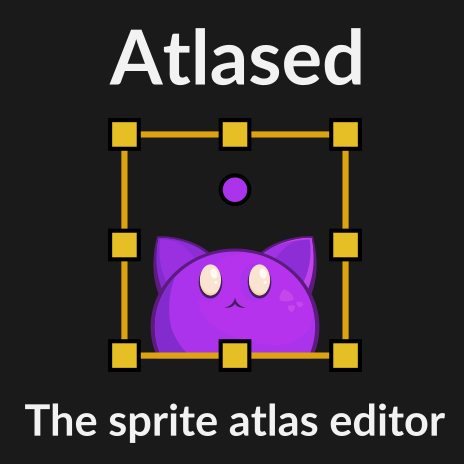
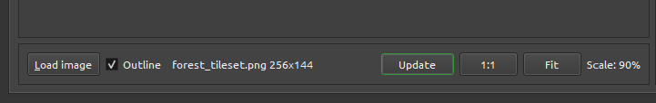

# Atlased user manual

**<div style="text-align:right">v1.1.2a</div>**

## Table of contents
- [Atlased user manual](#atlased-user-manual)
	- [Table of contents](#table-of-contents)
	- [What is Atlased](#what-is-atlased)
		- [Atlased is](#atlased-is)
		- [Atlases is NOT](#atlases-is-not)
		- [Why use Sprite Sheets or atlases](#why-use-sprite-sheets-or-atlases)
		- [Why Atlased exists](#why-atlased-exists)
		- [Game engines support](#game-engines-support)
			- [Plugins and extensions](#plugins-and-extensions)
			- [Loading Atlased files directly](#loading-atlased-files-directly)
		- [Compatibility with other software](#compatibility-with-other-software)
		- [License and usage](#license-and-usage)
		- [System requirements](#system-requirements)
		- [Main features](#main-features)
		- [Basic concepts](#basic-concepts)
	- [Creating atlases](#creating-atlases)
		- [Creating new Regions](#creating-new-regions)
			- [Manual](#manual)
			- [Grid-based](#grid-based)
			- [Autotracing](#autotracing)
		- [Editing existing Regions](#editing-existing-regions)
			- [Basic editing](#basic-editing)
			- [Growing Regions](#growing-regions)
			- [Working with Origin Points](#working-with-origin-points)
				- [Batch copy-paste](#batch-copy-paste)
			- [Region Indices](#region-indices)
		- [Saving and previewing your work](#saving-and-previewing-your-work)
		- [Updating an Atlas image in other software](#updating-an-atlas-image-in-other-software)
	- [Exporting](#exporting)
		- [Separate sprites](#separate-sprites)
		- [Tiled editor tilesets](#tiled-editor-tilesets)
			- [Preparation](#preparation)
			- [Image-based](#image-based)
				- [Atlas info group](#atlas-info-group)
				- [Output](#output)
				- [Geometry](#geometry)
			- [Collection-based](#collection-based)
	- [Sprite Packing](#sprite-packing)
		- [Adding or removing sprites](#adding-or-removing-sprites)
		- [Tweaking the Sprite Packer](#tweaking-the-sprite-packer)
			- [General](#general)
			- [Page size](#page-size)
			- [Padding \& Grid](#padding--grid)
		- [Finalizing packing session](#finalizing-packing-session)
	- [JSON file format](#json-file-format)
		- [Coordinate system](#coordinate-system)
		- [General section](#general-section)
		- [Regions](#regions)
		- [Full example](#full-example)
	- [Configuration](#configuration)
		- [Default paths](#default-paths)
		- [Output options](#output-options)
		- [Appearance](#appearance)
		- [Saving and loading configuration](#saving-and-loading-configuration)
	- [Known limitations](#known-limitations)
	- [Future plans](#future-plans)
	- [Credits](#credits)

## What is Atlased

<div style="text-align:center;">

</div>

**Atlased** is a **Sprite Sheet and Atlas editor** meant to be used as a support tool for *2D games* development, asset preparation pipeline, game jam sessions, etc.

It is capable of **creating Sprite Atlases** (both images and markup) and performing various editing and **export operations**.

### Atlased is

* **Atlas markup tool** -  you can create and change **Regions within existing image files**.
* **Sprite Packer** - you can **create new Sprite Sheet images** from a set of separate sprites and get automatically created Regions.
* **Sprite Slicer** - you can disassemble existing Sprite Sheets into separate pictures.

### Atlases is NOT

* **Graphics or pixel art editor** - for any image manipulations and editing use [Aseprite](https://www.aseprite.org/), [Krita](https://krita.org), [GIMP](https://www.gimp.org/) or whatever you like. You still can create new images using Sprite Packing feature.
* **Animation software** - you can try and use Atlased for animations, but there's no direct support yet; better use programs such as [Aseprite](https://www.aseprite.org/) or [Krita](https://krita.org) which have ["onion skinning"](https://en.wikipedia.org/wiki/Onion_skinning) and other really cool features.
* **Texture editing tool** - use dedicated software for that.
* **Image collection arranger** - no, it is not.

### Why use Sprite Sheets or atlases

Sprite Atlas is a good way to organize game art to save work for GPU, game engine and for the developers (look for *Sprite batching* and/or *texture batching* online; it is a technique of putting multiple data pieces into one single structure called "batch" to minimize the workload for software and hardware ).

It is quite handy and efficient to have all your game sprites and tiles compiled into a single image (there could be many of these "compiled images", depending on your project size) and then query them for sub-areas containing graphics for game objects rather than loading and storing separated sprites and trying to keep track of a growing asset base.
Likewise, it is much easier for GPU to "bind" one single texture and draw most of your game level graphics from it’s sub-parts rather than constantly switch between dozens of different textures containing separate sprites.

Also, grouping sprites into sheets or atlases simplifies version control, file exchange, team cooperation and gives you another occasion to overview the coherency of your artwork.

**Atlased** provides developers with a toolset to create both Atlas textures (via **Sprite Packing**) and a corresponding markup for them (using various methods inside the editor). [PNG](https://en.wikipedia.org/wiki/Portable_Network_Graphics) format is used for images and [JSON](https://en.wikipedia.org/wiki/JSON) is used for markup (meta-data describing sprites geometry, etc.)

All you have to do in your **game code** is to **load or import images** and **use data from [JSON files](#json-file-format)** to build some kind of table:

`frame_name : image sub-area description`.

You could also hash frame or Region names to speed things up.

Then you or your programmer should just query that table (or Sprite manager class, or whatever code structure you came up with) in your game code for the image parts that you require and send them to your rendering code.

**See [Game engines support](#game-engines-support) and [Loading Atlased files](#loading-atlased-files-directly) for more info.**

### Why Atlased exists

The goal behind the creation of Atlased was to make a user-friendly Atlas markup and Sprite Packing tool which could be used on multiple platforms and also be compatible with as much programming languages and engines as possible. In addition to that there was an editor which is versatile, not overly bloated with excess features and also accessible, that's why Atlased exists.
*<div style="text-align:right">Atlased is written in C++ using the [Qt framework](https://www.qt.io/).</div>*

[<div style="text-align:center">Table of contents</div>](#table-of-contents)

### Game engines support

Atlased is designed around commonly used and open file formats: PNG and JSON, which are supported nearly everywhere. So anyone could code a simple loader or importer using almost any programming language to load PNG images and parse JSON. It's pretty simple.
#### Plugins and extensions

"Direct" engine support is traditionally done via engine plugins or add-ons, which help to import assets into engine's ecosystem.
Currently, [Godot engine](https://godotengine.org/) is supported via [Godot editor plugin](https://github.com/kzerot/GodotAtlasedImporter) created by Maxim Brajsky.

#### Loading Atlased files directly

It is highly unlikely that someone could cover all the needs and ways of game assets usage and also integrate a tool with all the existing engines, languages and frameworks.

So options for a "direct" support are reasonably limited by the time that one could spend on development and maintenance of export plugins. But future extensions are entirely possible.

Meanwhile, if you're interested in incorporating Atlased into your workflow or making something custom with it, *make sure to start from your engine/framework documentation* to determine if it can load JSON at all (most probably it can). 

Loading JSON files is a fairly easy task and shouldn't take too much effort to complete.
 
**Make sure to check out the [Atlased JSON file structure documentation](#json-file-format). It is really short and simple** :)

**NOTE:** *To work with Atlased resources you need to load/import both PNG and JSON files for each created Atlas and have them accessible for your game code.*

**Here are some links on working with JSON files in various popular engines:**

* [Godot engine](https://docs.godotengine.org/en/stable/classes/class_json.html)
* [Unity](https://docs.unity3d.com/Manual/JSONSerialization.html)
* [Unreal Engine 4](https://docs.unrealengine.com/en-US/API/Runtime/Json/Dom/FJsonObject/index.html)
* [Construct 3](https://www.construct.net/en/make-games/manuals/construct-3/plugin-reference/json)
* [Game Maker Studio](https://docs.yoyogames.com/source/dadiospice/002_reference/file%20handling/json_encode.html)
* [Defold](https://defold.com/ref/json/)

**Languages:**

* C++ - see [jsoncpp](https://github.com/open-source-parsers/jsoncpp) or [nlohmann/json](https://github.com/nlohmann/json) as an example. 
* [Rust](https://github.com/serde-rs/json)
* [Java](https://www.oracle.com/technical-resources/articles/java/json.html)
* [Java(LibGDX)](https://github.com/libgdx/libgdx/wiki/Reading-and-writing-JSON)
* [Python](https://docs.python.org/3/library/json.html) - *should also do fine for [PyGame](https://www.pygame.org/news)*
* [Lua](https://github.com/rxi/json.lua) - *should also work for [Love2D](https://love2d.org/)*

### Compatibility with other software

Aside from text editors and any software that could work with PNG files, **Atlased** has the ability to export Sprite Sheets into [Tiled level editor](https://www.mapeditor.org/) to use images and their Regions as "brushes" for level design.
See the [corresponding chapter for exporting from Atlased to Tiled](#tiled-editor-tilesets).

### License and usage

**Atlased is "pay-what-you-want, including free" software, even for commercial usage.**
Everything that you create using Atlased is your complete property.
**If you want to financially support my work and boost improvements, you can [buy Atlased on itch.io](https://witnessmonolith.itch.io/atlased).**
Also make sure to share with friends, tag Atlased in your project, Twitter, Youtube and whatever :)
Your support is greatly appreciated!
*<div style="text-align:right"> You can use Atlased for whatever you want: game jam, indie game, hobby project, studio pipeline, etc. </div>*

### System requirements

**Display**: at least 1366x768 16:9 monitor; bigger screen is recommended.
**Storage:** 40MB of available space.
**Memory:** 512MB RAM.
**Runs on 64-bit Windows 10, Linux Mint 19+, Ubuntu 18+, Manjaro Linux and Debian 10.**

[<div style="text-align:center">Table of contents</div>](#table-of-contents)

### Main features

 * **Sprite Packing**: glue separate sprites together in an efficient manner, producing PNG+JSON file pair for each packed "page" of images.
 * **Autotracing**: detect sprites within a Sprite Sheet automatically, creating JSON markup
 * **Create** and edit **atlases** by manually setting Regions, grid, Origin Points, etc.
 * Resize, rename, move and **grow** operations
 * Copy and paste Sprite's **Origin Point** from one Region to another (in batches too!)
 * **Configure application** export paths, behavior and color parameters to your liking
 * **Undo/redo** for every main operation
 * **Export** from Atlas to **separate sprites** (aka *slicing*)
 * **Export to tilesets** for [Tiled editor](https://www.mapeditor.org/)

 Go check [Future Plans](#future-plans) to see what's possible next.

### Basic concepts

* **Sprite** — single static image, typically representing a game object
* **Sprite Sheet** — a set of Sprites, "glued" together into a single image file
* **Markup** — JSON document describing how Sprites are positioned within the Sprite Sheet
* **Region** — named rectangular area within the Sprite Sheet containing graphical information as described by Markup
* **Origin** — "the center" of a Region, described in Region's local coordinates from top-left corner (also may be called "Pivot", "Anchor" or even "Offset")
* **Atlas** — Sprite Sheet with accompanying markup (PNG+JSON file pair)
* **Sprite Packing** — process of "gluing" sprites together into a single image, often producing a Markup along the way
* **Page** - single result of a Sprite Packing operation, basically an Atlas
* **Autotracing** — process of detecting single sprites within a bigger image composed of several objects

[<div style="text-align:center">Table of contents</div>](#table-of-contents)

## Creating atlases

To create a new Sprite Sheet use **"File-New" menu action** or press **Ctrl-N**.
Atlased will present you with new a tab containing a working area for your new Atlas.


Each **Atlased tab** corresponds to **one single file**. *Some File menu actions such as "New", "Open" and "Pack sprites" will create new tabs.
Tabs are closed with **"Ctrl-W"** shortcut or via **"File-Close"** menu action or just by using the **"cross" icon** on the tab itself.

**NOTE:** *When a new tab appears you will be presented with a list of quick tips for controls to get you going.
This list will disappear once you load a Sprite Sheet image inside your new tab.*

The area where the quick tips are placed is where your image will be. It is called "Work view".
Controls beneath:

* **Load image** - button which will display a standard loading dialog to get an image to work with; you can also just drag-and-drop image from your file manager, desktop, etc.
* **Outline** - checkbox to toggle outline around your loaded image, becomes available after the image is loaded.
* **1:1** - set zoom to display an image in its actual size.
* **Fit** - scale image to fit inside current work view.
* **Scale** - displays current scaling factor.

Panel on the right is responsible for displaying and controlling Region-related data.
From the top:

* **Grid** checkbox enables Region grid to help you with creating tile-like layouts.
* **Cell size** text edits - this is where you set your grid size in pixels.
* **Set** button - applies a grid size that you defined in the text edits.
* **Regions** - simple Regions counter.
* **Auto** - button to (re-)create Regions automatically by tracing sprites inside your loaded image.
* **From grid** - button to create a new Region inside each grid cell, if grid is enabled.
* **Remove all** - removes all Regions within current tab.

### Creating new Regions

The main purpose of Atlased editor is to be able to define Regions with some additional info within the loaded images.
These Regions could be created in different ways.
This section deals with creation of a new Region sets. For [editing or changing](#editing-existing-regions) of existing Regions, please refer to the [corresponding section](#editing-existing-regions).

#### Manual

To manually create a Region, first load an image and then **Ctrl-drag** with your **left mouse button**(LMB).
Click inside your newly created Region to be able to modify it's size directly and parameters inside panel on the right.


#### Grid-based

Grid mode allows for creation of **Regions which size is aligned to the grid cells**.
First, enable grid mode by clicking the **Grid checkbox**.
Then, set the grid size and press the **Set button**.
This should make your grid visible and operational.

**NOTE:** *You can disable grid at any time to add some non-aligned Regions, but beware that this possibly could introduce some inconsistency into some program functions such as exporting.*

* To create a **single** Region **Ctrl-Shift-click** in an empty cell.
* To create a **batch** of grid-sized Regions use **Ctrl-Shift-drag** with LMB.
* To create a **single Region which is bigger** than a single cell use **Ctrl-drag** with LMB.


#### Autotracing

**Atlased** is equipped with a special tool that allows to **create Regions automatically**.
It will try to **detect** the **sprites** within your loaded image and should succeed if the **background color** of your Sprite Sheet is a solid color which is different from your sprites (all transparent or all green and so on). This is also known as *"color keying"*.

To use this feature, create a new Atlas, load an image and press the **"Auto" button** in the Regions panel on the right.


For this to work correctly the **"empty" color** value is required.
This is the color which will be considered "background" or "empty" by the tracing algorithm.
It defaults to "transparent black" (`#000000`) and should work for the most cases.
But should you do something with a **custom color key**, press **"Pick" button** and use the eyedropper tool (your cursor will change to a little crosshair) to point the **Autotrace dialog** to the correct color sample within your image.

**NOTE:** *The background color selection button is also there, but it’s purpose to create convenience of color matching, in case if a loaded image’s colors will be conflicting with the view’s default background color. **This setting does not affect the Autotracing process.***

After you review the "Empty color" setting, press the **Run button** and see the results inside your Atlas tab.


This feature is particularly useful when dealing with large Sprite Sheets that need to be sliced into smaller parts. See [Exporting Regions as separate sprites](#separate-sprites).

**NOTE:** *When your sprites contain small separated details or your pixel-art is using tiny resolution with a lot of tiny features (like 1-5px), Autotrace could produce noisy results which could be fixed and polished manually inside the Region Editor.*


[<div style="text-align:center">Table of contents</div>](#table-of-contents)

### Editing existing Regions

This section deals with changing and adjusting existing Regions.
For adding new Regions, refer to the ["Creating new Regions"](#creating-new-regions) section.

#### Basic editing

Regions could be edited in two basic ways: by adjusting their size and position by hand or by entering these parameters inside the corresponding Region panel.


Region panel items:

* **Name** - Region name as it will be saved into the JSON file and appear inside your game code.
* **Pos** - top-left corner coordinates.
* **Size** - Region width and height.
* **idx** - Region numerical identifier(unique) inside of an Atlas.
* **Origin** - Origin Point position relative to the top-left Region corner.
* **Rotated** - checkbox, indicating that Sprite is rotated 90 clock-wise.
* **"X" button** - deletes the Region when pressed.

Basic Region operations:

* Click on a Region to select it.
* **Drag*** selected Region to move it around.
* **Click-drag** from some unoccupied place to **select multiple**.
* **Shift-click** to **(de)select multiple**.
* **Left-click and drag** on any of the **square handles** that appear **after selecting** the Region to **resize** the Region.
* **Enter values directly** by using the **region’s panel** on the right. **Ctrl-scroll** to dial the values inside the panel.
* Set **"rotated"** property by toggling the **Rotated checkbox** inside the Region's panel to indicate that this particular Sprite is rotated 90 degrees clock-wise.
* Select your Region and hit the **Del key on your keyboard** to **remove** the selected **Region**.
* Hit the **"X" button** inside the **Region's panel** to **remove** that Region.
* **Ctrl-Alt-drag** with LMB to **remove Regions under selection box**.
* Press **Remove all button** to **clear** your **Atlas** of any traces of markup.


#### Growing Regions
Sometimes it is necessary to add that thin single pixel border around your Sprite to avoid sampling artifacts. Or simply a Region itself could’ve been bigger.

To grow selected Region(s):
* Select the Regions that should get bigger
* Use the **Edit-Grow menu action** or **Ctrl-G** to **enlarge selected Regions**.
* Use the **Edit-Undo menu action** or **Ctrl-Z** shortcut to **reverse the effect**.


#### Working with Origin Points

To display Origin Points, use **View-Origins** and **View-All origins** menu actions.
After that the small circle will appear inside selected Regions (or all of them, if you toggled *All origins*).
Drag this round handle to adjust Sprite's Origin Point position.


**NOTE:** *Origin point coordinates are relative to the top-left corner of each particular Sprite.*

##### Batch copy-paste

You can copy Origin Point position from one Region to another or to a group of selected Regions.

1. Select your source Region.
2. Press **Ctrl-Shift-C** or use **Edit-Copy origin** menu action.
3. Select your target Region(s).
4. Press **Ctrl-Shift-V** or use **Edit-Paste origin** to paste Origin Point position to your whole selection.

#### Region Indices

Each **Region** is **automatically assigned** with own **unique index** within a **single Atlas**. This is done to have an id system which is parallel to the string names that are set by a user. Indexes will be written to the JSON file(s) along all other Region-related data.
Each time you add a Region, Atlased will give it a new unique (un-occupied) index.

There are two basic rules which Atlased is applying automatically while assigning Indices.
**For non-grid atlases:** all Indices are generated basing on Region position (growing from left-to-right, top-to-bottom).
**For grid-enabled atlases:** all Indices are derived from the grid coordinates.
This way Indices will have more stability and consistency for further usage in game code or other software.

**NOTE:** *If you happen to stumble upon some unexpected indexing behavior or just want to redo the whole index table within an Atlas, use **Edit-Re-create Indices** menu action, and it will create a whole new set of Indices for you.*


### Saving and previewing your work

Hit Ctrl-S to save or Ctrl-Shift-S to "save as" your current tab.
The dialog will appear asking you for the name of the JSON file.

**NOTE:** *Default locations are described in "[Configuration section](#configuration)".*

After saving your Atlas you are able to **quickly preview both JSON and PNG files** inside your system's default applications via **"File-Show"** actions menu.


[<div style="text-align:center">Table of contents</div>](#table-of-contents)

### Updating an Atlas image in other software

Since 1.1.2a you can edit your Atlas images outside Atlased.
And there are two options here to sync changes with Regions and geometry data after you've edited your image:

* Reopen your Atlased file by using button inside the "File" menu;
* Hit the "Update" button in Atlased lower panel;



Each option will automatically change the corresponding JSON markup file to mirror the actual image geometry.

**If an updated image has lower dimensions than before, the old Regions outside the newly defined boundaries will be discarded**.

After the image has been reloaded, make sure to verify and save the changes.

[<div style="text-align:center">Table of contents</div>](#table-of-contents)

## Exporting

### Separate sprites

After defining the Regions inside your Atlas you can export them as a bunch of separate PNG images to the specified destination.
To do so, use **"File-Export to-Sprites** or **"File-Export to -Sprites(selected)"** menu actions to respectively export all or only selected Regions.
The dialog will appear asking you of the destination directory. After receiving a valid address in your file system, Atlased will save all Regions as PNG images with color format of the source Atlas using the **quality setting** from the [Configuration](#configuration).


### Tiled editor tilesets

[Tiled](https://mapeditor.org) is a versatile tile-based level editing tool and is quite known and popular among the game developing community.

**Atlased** provides the ability to create tilesets from Sprite Sheets and atlases to use as a collection of brushes or other asset source from within Tiled.

There are [two main ways to create a tileset in Tiled](https://doc.mapeditor.org/en/stable/manual/editing-tilesets/):

* Use a single picture and establish a grid-like geometry within to define individual tiles.
* Use a collection of separate images to create a *"collection tileset"*; allows working with tiles of a different size.

Atlased supports both options and produces a JSON-based tileset files accompanied by corresponding PNG images.
*<div style="text-align:right">Please, refer to the [Tiled documentation](https://doc.mapeditor.org/en/stable/) to get more details on how Tiled operates.</div>*

For the demo purposes we will be using a [Sprite Sheet](https://opengameart.org/content/a-platformer-in-the-forest) created by [opengameart.org](https://opengameart.org) user named [Buch](https://opengameart.org/users/buch). Kudos to Buch!


#### Preparation

1. Create your Atlas either by [Sprite Packing](#sprite-packing), [Autotracing](#autotracing), [manually](#manual) or by using a [Region Grid](#grid-based).
2. (Optional) Go to the [Configuration dialog](#configuration) and set paths to export to your Tiled project location:
   * **Tiled tileset path** is where your resulting Tiled JSON file will reside (typically you'll want it inside your Tiled project folder);
   * **Tiled images path** is where your tileset images will be stored (probably it's best to keep them in a project subfolder as well).

After [creating some Regions](#creating-new-regions) our Atlas looks like this:


Next, go to the **"File-Export to"** menu and select the type of export that suits your needs.


#### Image-based

Image-based tileset export uses a grid to slice up your Atlas and create tiles suitable for the Tiled editor.
Region data is irrelevant.

Tilesets of this type use a single image as their base and require some settings to properly detect underlying tiles.
When using this type of export the Tiled export dialog will look like this:


Below are the description of the option widgets from top to the bottom.
##### Atlas info group

This is a box which contains the general info about your source Atlas.

* **Name** - the name of your Atlas.
* **Regions** - overall number of Regions that is within your Atlas.
* **Image** - source image info (file name and size).
* **Grid size** - size of your grid in pixels. *Will be highlighted if your Atlas is using a grid*
* **Padding** - padding pixels at each side of a Region. Comes from the Sprite Packer or from your artist :) *Will be highlighted if your Atlas is NOT using a grid*

##### Output

* **Output base name** - the base name part for JSON tileset file and for corresponding image.
* **Custom tileset output dir** - path that will be used to save JSON file; *use this, if you want to override the [Configuration](#configuration) setting.*
* **Custom image(s) output dir** - path that will be used to save your image or images for easier access from Tiled; *use this, if you want to override [Configuration](#configuration) setting.*

##### Geometry

* **Convert from Atlased** - use Atlased padding or grid size values to derive the required Tiled params.
* **Set Tiled params directly** - define *Margin* and *Spacing* values which are used by Tiled editor.
* **Grid** (*active, when **Convert from Atlased** is selected*) - use Grid size to determine tiles geometry.
* **Override padding** (*active, when **Convert from Atlased** is selected*) - set your own *Padding* value (optionally, it may differ from one that is used by your Atlas)
* **Tile size** - most important setting in here - it is a size of a single tile within the tileset. *This is the actual tile size that will be used within the Tiled editor.*

After setting all the values, click **Export** and depending on where is your Tiled project and where you decided to save your files, you will see something like this inside the Tiled editor:


Our exported file here is `buch_tileset.json`.
**Double-click on it** and Tiled should open its tileset editor, where you can review the export results and/or tweak some additional settings.


Now you can use your exported tileset inside your Tiled project.


#### Collection-based

Collection-based tilesets are created from existing Regions data only. Grid is not used.

When exporting to a **collection-based tileset**, the export dialog will look different with the **"Geometry" panel disabled**.

Atlased will automatically perform an additional step of exporting all of your Regions to a set of separate sprites to the location that you've defined in [Configuration](#configuration) or inside the export dialog.
And then Atlased will create a JSON file which is compatible with Tiled.

**NOTE:** *Please, be careful while using the collection-based export, for it may produce a big amount of images. Set the images output path to something that will not mess up your project structure. Using separate directories is advised.*

Here's how collection-based export looks like inside the Tiled editor.


**NOTE:** *if you're into using only those tiles which you've created Regions for, you may choose to do an additional step inside Atlased. Export your Regions to separate sprites. Then pack them into a new Atlas. Then export this Atlas as an image-based Tiled tileset. This will keep your project organized and more clean.*
[<div style="text-align:center">Table of contents</div>](#table-of-contents)

## Sprite Packing

This program comes with a simple yet decent Sprite Packer. To create a completely new Atlas from separate images, use **"File-Pack sprites" menu action**.
There are two tabs inside this dialog.
First one called **"Options"** and is the default one to be shown at startup and contains different **Sprite Packing settings** which you can tweak to achieve suitable results.
Second one is called **"Sprites"** and contains a **list of input sprites** added for packing.
On the right there is a **preview area** which will show you how your Sprite Sheet will appear after completion.


Buttons above the preview area:

* **<** - previous page (Sprite Sheet) from the Sprite Packing results.
* **>** - next page from the Sprite Packing results.
* **Fit** - fit the page image to fit the preview area.

### Adding or removing sprites

To add images for packing go to the **"Sprites"** tab and press the "Add" button.
Alternatively, you can drag and drop images from your file manager into the sprites list.
Or, you can drop them directly into the preview area.


Each time when at least one single image is added, Sprite Packer will start to do its job – producing packed Sprite Sheets and updating the preview.

**NOTE:** *When all the sprites that you added could not fit inside a single page of the maximum dimensions (these are set inside the "Options" tab), Sprite Packer will create additional page to fit leftover sprites there. Also, each page comes with fill rate metric to tell you how well your sprites are utilizing the page area. Don’t overthink this data, though.*

See below how the Sprite Packer created two pages instead of one when the maximum page size was changed to a pair of smaller values. Use navigate buttons to switch between pages preview.


**NOTE:** *If you accidentally added a Sprite that on its own is bigger than the maximum page size, Sprite Packer will warn you about that and that enormous Sprite will not appear inside any page until you tweak the maximum page size accordingly.*


To remove a Sprite, press the corresponding **"Remove" button** inside the list of the **"Sprites" tab** and your preview will be updated to reflect all the sprites that are left in the list.

### Tweaking the Sprite Packer

Options tab contains all the parameters that affect how your packed pages will be formed.
**After you change something** in these settings, make sure you **hit the "Preview" button** to see the effects.


#### General

* "Custom output dir" is a way to export final atlases to a location different that is set inside [Atlased Configuration](#configuration). If you leave this field unchecked or empty, PNG and JSON files will be saved to the default paths or, if they’re not specified either, to a directory which application will ask you to point.
* "Output files base name" parameter sets the base for all the resulting PNG and JSON files created from the packed pages. For example, after tweaking all the options you produced 3 pages and set the "Output files base name" to "my_atlas". Then files will be named as following: "my_atlas_0.png/json", "my_atlas_1.png/json" and "my_atlas_2.png/json". When there is only a single resulting page no numerical suffix will be added to file names.
* "Allow 90 rotation" toggles the behavior of the Sprite Packer when it will attempt to maximize the packing efficiency by rotating some of the sprites 90 degrees clockwise. Leave it unchecked if Sprite rotations are unwanted. Note: currently rotation could not be used at the same time with grid.
* "Create regions" switch will tell the Sprite Packer to create Regions within the JSON counterpart of the PNG Sprite Sheet. Uncheck it to avoid creating any markup.
* "Show regions" checkbox will toggle Regions visibility within the preview area.

#### Page size

* "Minimum page width", "Minimum page height" – option that limits the minimum page size in pixels. You can’t set them less than 16px.
* "Maximum page width", "Maximum page width" – option that limits the maximum page size in pixels. You can’t set them greater than 4096px and less than 32px.
* "Power of two dimensions" switch will force Sprite Packer to create pages whose width and height will be a power of two. This could be beneficial for performance of (some) GPUs and some renderers.

#### Padding & Grid

These sections are interconnected.
* **"Padding X", "Padding Y"** are the values that would be added to left and right (Padding X) and top and bottom (Padding Y) sides of each Sprite.
* **"Include padding in Region geometry"** switch will force packer to enlarge each actual Region by padding values. For example, Region on itself has dimensions of 32×32px, padding settings are [4, 4], so the resulting Region size that will be written in JSON file will be 40×40px (32 + 4 + 4, 32 + 4 + 4).
* **"Grid"** switch will turn the grid packing mode on. Note that this makes padding settings irrelevant (these two modes are not supposed to be used simultaneously).
* **"Grid visible"** toggles grid lines visibility within the preview area.
* **"Grid width"** sets the single grid cell width in pixels.
* **"Grid height"** sets the single grid cell height in pixels.

### Finalizing packing session


After you are satisfied with the preview, hit "Ok", specify the save location and all the newly created atlases will be opened in editor tabs.

## JSON file format

Atlased uses JSON for it's output file format for Sprite Sheet geometry metadata.
This document describes Atlased JSON file structure.

Hopefully this will make it easier to grasp how to parse Atlased files and use them inside a game or a game engine, or an engine plugin.

*All entries will be supplied with example values.*

### Coordinate system

Atlased utilizes a coordinate system that is really common among other 2D applications and game engines:

* `[0, 0]` is at the top-left.
* `X` axis is directed to the right.
* `Y` axis is directed down.

### General section

This is the topmost level of a JSON document.

```json
{
	"name": "atlased_cosmic_kitties",
	"image": "cosmic_kitties.png",
	"fill_rate": 0.86,
	"width": 512,
	"height": 512,
	"using_grid": true,
	"grid_width": 32,
	"grid_height": 32,
	"padding_x": 0,
	"padding_y": 0,
	"rotations": false,
	"pot": true,
	"regions_count": 4,
	//...
}
```

* `name` - the id string under which the Atlas will be known to your game's resource system;
* `image` - the name of the image this JSON corresponds to; in most cases this would be the pure file name with extension.
  **NOTE:** *Atlased doesn't support relative or absolute image paths in JSON and stores only the file name. You have to address this in your resource system.*
* `fill_rate` - informative field, rarely used; indicates the area usage efficiency within the Sprite Sheet:
$$ fillrate = \frac{regionsArea}{imageArea} $$
* `width` and `height` - Sprite Sheet size in pixels;
* `using_grid` - when set to `true`, indicates that the Sprite Sheet is using a grid layout for its Regions;
* `grid_width`, `grid_height` - a singular grid cell size in pixels;
* `padding_x`, `padding_y` - padding space around each single Region in pixels; these settings are affecting whole Sprite Sheet globally; `padding_x` is added to the left and right sides, `padding_y` - to the top and the bottom of each Sprite; *NOT IN EFFECT WHEN GRID IS USED*.
* `rotations` - informative field, when set to `true` it indicates that some sprites may be presented with 90 degrees clock-wise (CW) rotation;
* `pot` - informative field, when set to `true` it indicates that the used image has the power-of-two dimensions;
* `regions_count` - informative field, holds the total number of Regions within this Atlas.

### Regions

Information on Regions is stored inside the top-level array entry `regions`

```json
{
	//...
	"padding_x": 0,
	"padding_y": 0,
	"rotations": false,
	"pot": true,
	"regions_count": 4,
	"regions": [
	]
	//...
}
```

Each Region's data is an object stored inside the `regions` array:

```json
{
	//...
	"regions": [
		{
			"name": "cosmic_cat",
			"rect": [64, 0, 32, 32],
			"origin": [16, 16],
			"rotated": false,
			"idx": 3
		},
		//...
	]
}
```

* `name` - a string id, unique within the Atlas.
* `idx` - a numerical id, unique within the Atlas.
* `rect` - a geometry array, describing the Region's rectangle in the following order: `[x, y, width, height]`. All dimensions are in pixels. `x` and `y` are the coordinates of the top-left corner of the rect.
* `origin` - a geometry array with `x` and `y` coordinates of the "central" point of the Sprite. Could be used for an offset while rendering, a ground level for simple collision-detection, as a rotation point and other such things. `origin` coordinates are relative to the Region's `x` and `y`.
* `rotated` - tells that this Region's Sprite is rotated 90 degrees clock-wise;

### Full example

```json
{
	"name": "atlased_cosmic_kitties",
	"image": "cosmic_kitties.png",
	"fill_rate": 0.86,
	"width": 512,
	"height": 512,
	"using_grid": false,
	"grid_width": 0,
	"grid_height": 0,
	"padding_x": 8,
	"padding_y": 8,
	"rotations": true,
	"pot": true,
	"regions_count": 4,
	"regions": [
		{
			"name": "cosmic_cat_1",
			"rect": [0, 0, 32, 32],
			"origin": [16, 16],
			"rotated": false,
			"idx": 0
		},
		{
			"name": "cosmic_cat_2",
			"rect": [32, 0, 32, 32],
			"origin": [16, 16],
			"rotated": false,
			"idx": 1
		},
		{
			"name": "cosmic_cat_3",
			"rect": [64, 0, 32, 32],
			"origin": [16, 16],
			"rotated": true,
			"idx": 2
		},
		{
			"name": "cosmic_cat_4",
			"rect": [128, 0, 32, 32],
			"origin": [16, 16],
			"rotated": false,
			"idx": 3
		}
	]
}
```

[<div style="text-align:center">Table of contents</div>](#table-of-contents)

## Configuration

**Atlased** allows tuning most of its significant parameters to enhance your working process.
To access the Configuration, go to the corresponding main menu section.


### Default paths

Configuration dialog allows you to select some default locations to automate file and directory operations to fit best into your workflow.


There are five general path settings for Atlased:

1. **Atlases path** — program will start here when you tell it to open or to save a file. By default, Atlased expects that JSON and PNG files are placed inside the same directory. Atlased will search for JSON files inside the specified directory and will start from its binary location, if atlases path is left empty.
2. **Atlas images path** —  specifies default directory where Atlased will search for PNG files when loading atlases from path specified in the first option. This way you can have special separate directories for JSON and PNG files. However, when Atlas is being loaded from some other location than standard, Atlased will search for PNG file inside that specific location. This option defaults to "Atlases path" value, when disabled or unset.
3. **Non-packed sprites path** — directory to start from when packing multiple sprites into an Atlas. This setting defaults to the value from «Custom Atlas images path» when disabled or unset.
4. **Tiled tilesets path** — default directory to store JSON files for Tiled tilesets (*usually, you'll want it to be your Tiled project folder*)
5. **Tiled images path** — default directory to store images for Tiled tilesets (*maybe it's a good idea to store them inside a subfolder of your Tiled project*).

### Output options

* **Output PNG quality** - slider that regulates quality and, thus, the size of produced PNG files; this affects Sprite Packing and any form of export. The better the quality, the bigger the PNG file. 90 is sufficient for the most cases.
* **Minimize resulting JSON** - if checked, will "fold" all the JSON file contents in a single line; could increase loading times, depending on your project, typically useful for big files.

### Appearance

At the moment Atlased offers **two themes**: dark and light. They could be toggled in Configuration dialogue's **"Appearance" tab**.

Also, almost each of the items within the Region Editor area has its own color which could be changed using corresponding colored buttons as it shown in the image below.
**Base font size** option sets the **"normal" text size** *from which all fonts inside the app are derived*.
You can tune it to achieve better looks especially when *display/font scaling feature* from your OS is in effect.

### Saving and loading configuration

After you press the "Save" button all the changes that you've made to the paths, theme and colors settings will be written to the config file and then loaded up at the next startup.
Colors and theme changes are applied instantaneously.
[<div style="text-align:center">Table of contents</div>](#table-of-contents)

## Known limitations

* All output PNG files have the 32 bit format with alpha channel (*not pre-multiplied*). If you want to convert your Atlas images to indexed colors or grayscale use software like [GIMP](https://www.gimp.org/) or [Krita](https://krita.org).
* Currently, there is no “multiple move” operation, so you can’t select several Regions and move all of them at once.
* Maximum output image size is 4096×4096px.
* "Batch" operations for creating or removing Regions could be slow on some systems when performed on a dense grid for large images (like 2k in resolution). Atlased will warn you, though.
* No macOS support yet.
* No PNG compression is currently available.
* No other image formats are supported other than PNG.
* Only single JSON format is currently available. It is thoroughly described in [corresponding documentation](#json-file-format), so it should be a rather easy task to load and use it.
* Some UI accidents are possible on smaller screens (like 1366×768).

## Future plans

There are different ways on how Atlased could improve in a time.

The most relevant possible features are:

* **Animation support** and possible [Aseprite](https://www.aseprite.org/) format support for pixel-art animations.
* **Collision information editing** for each Region.
* **More group operations** such as multiple move.
* **UI/UX improvements** - more UX polishing and more flexibility in terms on visible UI elements, color themes, possible docking and such.
* **QoL improvements** such as Region search (by name or by id), Regions list sorting etc.
* **Arbitrary metadata editing** for each Region in addition to Origin Point (pivot points, "empties", spawn points, arbitrary values, etc.)
* **More export options** - custom JSON file formats, engines support and etc.
* **Transparent pixels handling** - there are ways to minimize transparency-related artifacts by processing transparent and "orphan" pixels near each Sprite's contour.
* **PNG compression**.
* **More color formats**.
* **More image formats support** - it is possible to add BMP, JPEG and others.

If you like the software and any of these plans, you can help with Atlased development by [making a purchase of Atlased at itch.io](https://witnessmonolith.itch.io/atlased). 

## Credits

Atlased, developed by [Witness Monolith](https://witnessmonolith.itch.io).

Art by [Pavel Nikanau aka Nuketurne](https://www.artstation.com/nuketurne)

["Platformer in the forest"](https://opengameart.org/content/a-platformer-in-the-forest) pixel-art by  [Buch](https://opengameart.org/users/buch)

If you like Atlased, please tell your friends and co-workers and consider supporting it on [itch.io](https://witnessmonolith.itch.io/atlased). Stay great :)

[<div style="text-align:center">Table of contents</div>](#table-of-contents)
